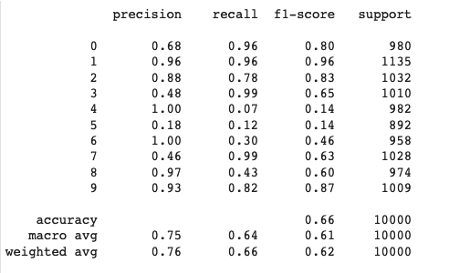

# transfer_learning_MNIST
This repo contains transfer learning models VGG, ResNet and SlimAlexNet for the classification of MNIST.  
The input channel and output layers are modified to fit the MNIST dataset. 
Here is the accuracy report of VGG: 
</img>

